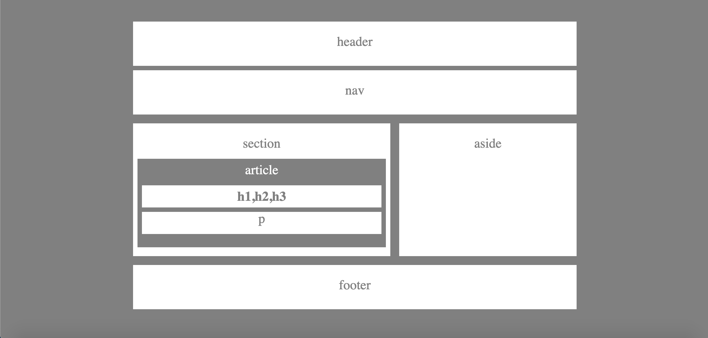

# HW-Wireframe

## Site Picture

## Technologies Used
- HTML - used to create elements on the DOM
- CSS - used to style the HTML elements on the page
- Git - version control system to track changes to source code
- GitHub - hosts repository that can be deployed to GitHub Pages

## Summary

This application is practicing making a wireframe by copying an example wireframe given. 

### Links
- [Wireframe](https://jerry-dudum.github.io/HW-Wireframe/)
- [LinkedIn](https://www.linkedin.com/in/jsdudum/)